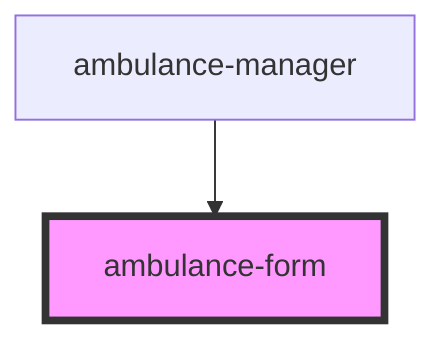

# ambulance-form

<!-- Auto Generated Below -->

## Properties

| Property    | Attribute   | Description | Type        | Default     |
| ----------- | ----------- | ----------- | ----------- | ----------- |
| `ambulance` | `ambulance` |             | `Ambulance` | `undefined` |

## Events

| Event        | Description | Type                           |
| ------------ | ----------- | ------------------------------ |
| `cancel`     |             | `CustomEvent<void>`            |
| `formSubmit` |             | `CustomEvent<AmbulanceCreate>` |

## Dependencies

### Used by

 - [ambulance-manager](../ambulance-manager)

### Graph

----------------------------------------------

*Built with [StencilJS](https://stenciljs.com/)*
