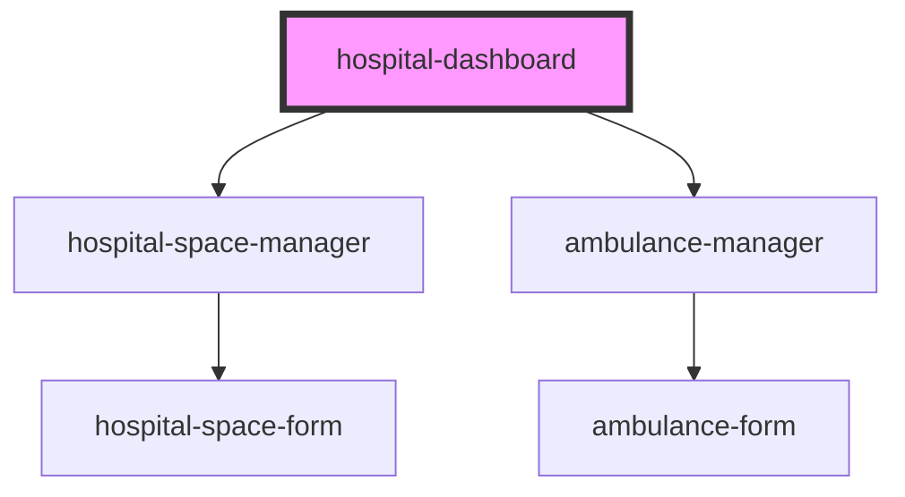

# hospital-dashboard

<!-- Auto Generated Below -->

## Properties

| Property  | Attribute  | Description | Type     | Default                       |
| --------- | ---------- | ----------- | -------- | ----------------------------- |
| `apiBase` | `api-base` |             | `string` | `'http://localhost:8080/api'` |

## Dependencies

### Depends on

- [hospital-space-manager](../hospital-space-manager)
- [ambulance-manager](../ambulance-manager)

### Graph

----------------------------------------------

*Built with [StencilJS](https://stenciljs.com/)*
