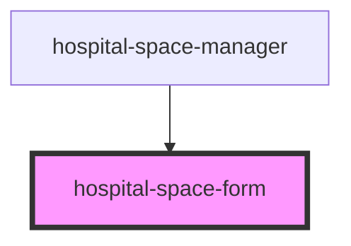

# hospital-space-form

<!-- Auto Generated Below -->

## Properties

| Property | Attribute | Description | Type            | Default     |
| -------- | --------- | ----------- | --------------- | ----------- |
| `space`  | `space`   |             | `HospitalSpace` | `undefined` |

## Events

| Event        | Description | Type                               |
| ------------ | ----------- | ---------------------------------- |
| `cancel`     |             | `CustomEvent<void>`                |
| `formSubmit` |             | `CustomEvent<HospitalSpaceCreate>` |

## Dependencies

### Used by

 - [hospital-space-manager](../hospital-space-manager)

### Graph

----------------------------------------------

*Built with [StencilJS](https://stenciljs.com/)*
